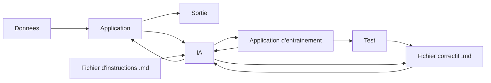

# 📊 V-CROP RAG

### Rapport de Projet

**Version 1.0** · *Date : 09/09/2026*

---

`Statut : 🟡 En cours` &nbsp;|&nbsp; `PARTIE C : Interface & livraison` &nbsp;|&nbsp; `Auteur : Levitre Mathys`

 

## 📌 Résumé exécutif

Le projet V-CROP RAG vise à retrouver des images à partir d'une description textuelle de leurs éléments constitutifs. La partie C porte sur la conception de l'interface utilisateur et la livraison de l'application. La maquette ainsi qu'une première page d'accueil et une messagerie sont indiquées comme réalisées, mais leur connexion au moteur de recherche et l'affichage des résultats restent à intégrer. La documentation est organisée avec MkDocs ; le pipeline applicatif et le déploiement Docker ne sont pas encore finalisés.

 

## 📋 Informations générales

| Champ | Détail |
|---|---|
| **Nom du projet** | V-CROP RAG |
| **Équipe** | Groupe 1 |
| **Date de début** | 09/09/2026 |
| **Date de fin prévue** | À définir |

 

---

## 🎯 1. Contexte et objectifs

L'objectif de la partie C est de fournir une interface permettant à l'utilisateur de formuler une recherche en langage naturel et de consulter les images correspondantes dans le dataset. L'interface doit transmettre la requête au moteur V-CROP RAG, puis présenter les résultats retournés. À ce stade, la maquette et les premiers éléments d'interface sont décrits comme réalisés, mais la recherche de bout en bout n'est pas encore reliée à l'application.

 

---

## 🛠️ 2. Méthodologie

Le fonctionnement visé relie l'indexation du dataset à la recherche et à la restitution des images dans l'interface.

 

---

## ✅ 4. Réalisations

## 4.1 - Tâches à réaliser
- [x] Maquettage de l'application
- [ ] Développment
    - [x] Création d'une page d'accueil
    - [x] Création d'une messagerie
    - [ ] Transfert de données via l'API
    - [ ] Affichage de la réponse
- [ ] Respect de la maquette
- [ ] Containerisation via Docker

 

## 🗒️ 8. Annexes

- Lien GitHub : https://github.com/dhesdin/sae_s5_vrag_crop

 

---

*Rapport rédigé par **Levitre Mathys** — Dernière mise à jour le 26/09/2026*

