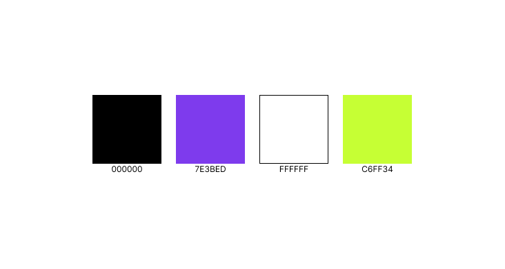
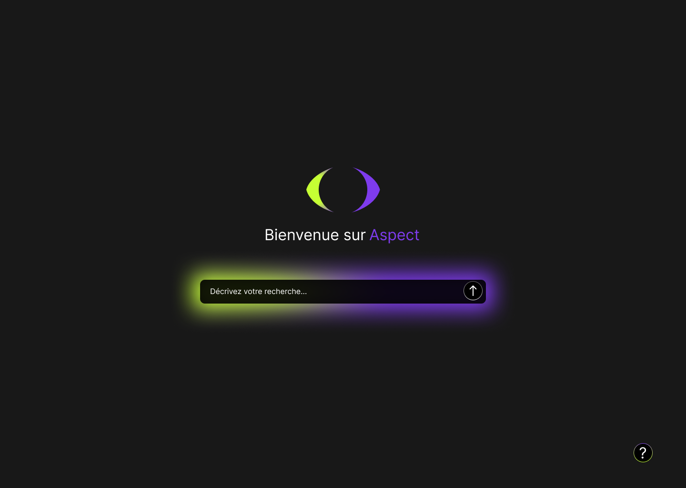

<h1>Rapport - LEVITRE Mathys</h1>

# Liste des objectifs
- [x] Compréhension du sujet
- [x] [Maquettage](#maquettage)
    - [x] [Charte graphique](#charte-graphique)
    - [x] [Premier aperçu](#premier-aperçu)
- [ ] Production terminée
- [ ] Connexion du front avec les données

## Maquettage
### Charte graphique

*Aperçu colori de l'interface*
### Premier aperçu

*Premier visuel de l'interface*
